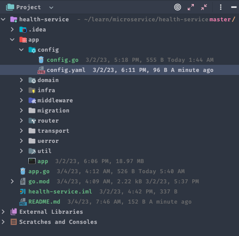
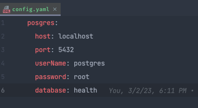
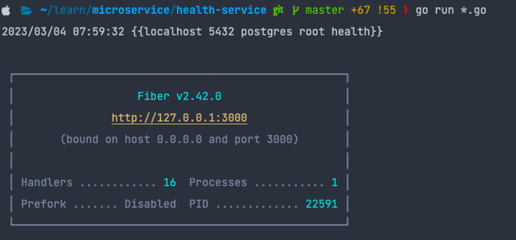
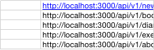

require:
+ go version 1.17
+ postgresql: 12

1. create postgresql info
     port: 5432
     userName: postgres
     password: root
     database: health
and change infomation database at: `api-gateway/config/config.yaml`

And change config at

At root project api-gateway
Run command: `go run *.go`

Success as bellow:

